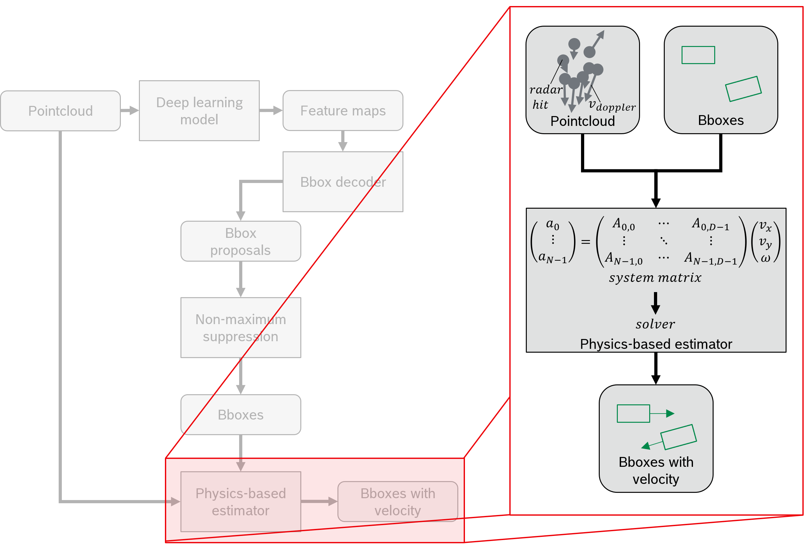
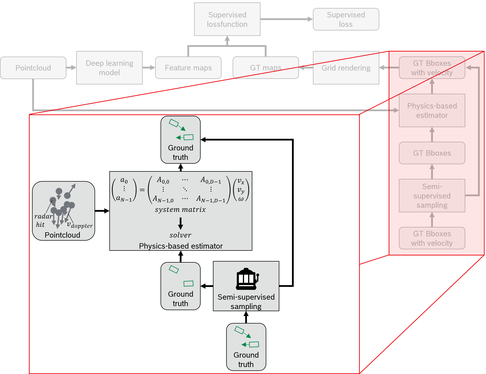
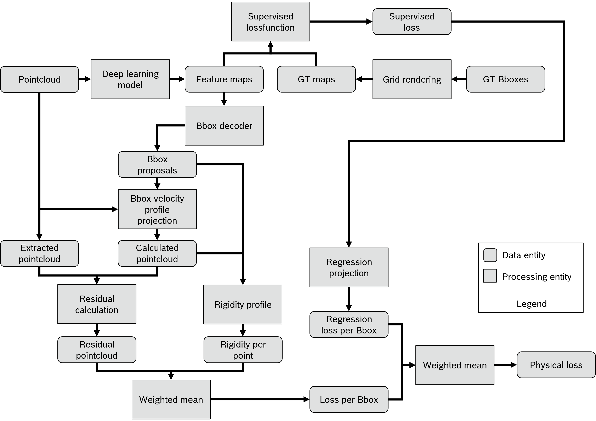
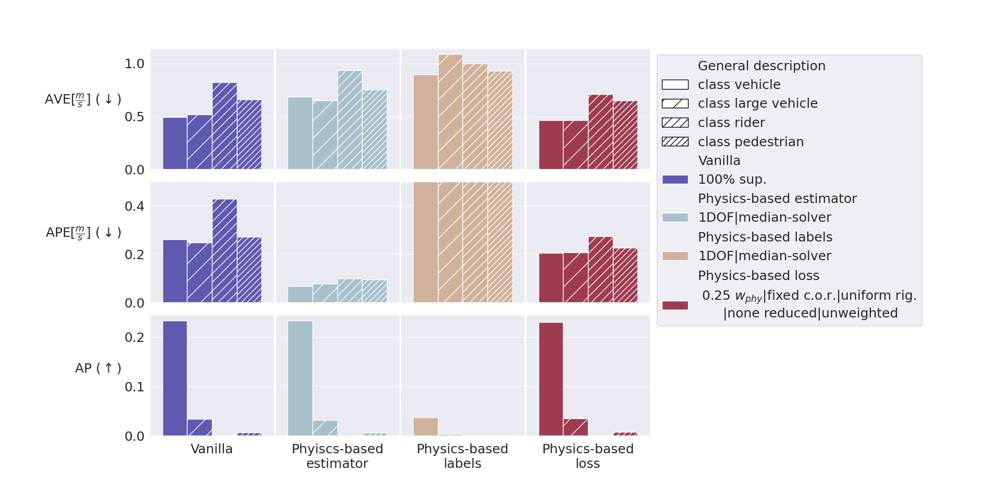
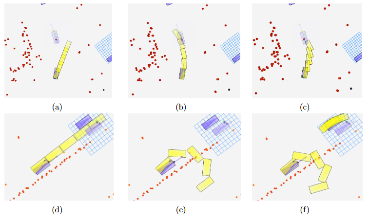
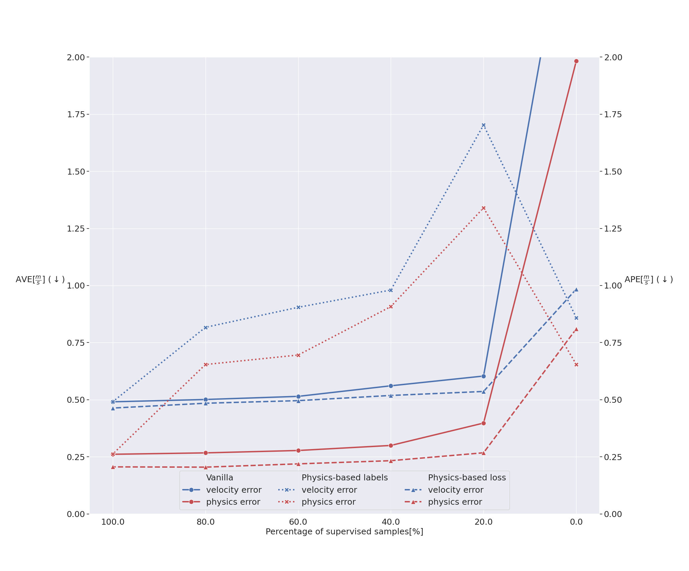

# Enhancing Radar-Based Velocity Estimation in Autonomous Driving: A Physics-Informed Hybrid Modelling Study

## Abstract

The detection and classification of other traffic participants are integral components of the perception task for autonomous vehicles. It is particularly challenging because not only static parameters like class association, position, and shape must be predicted, but also dynamic parameters like velocity need to be estimated. Even though other sensor modalities currently dominate autonomous vehicle sensor suites, radar has emerged as a competitive alternative, especially for velocity estimation.

This work investigates physics-informed hybrid modelling as a means of incorporating measured radial velocities into Deep Learning-based object detection and classification networks. Physical modelling is introduced at three stages of the pipeline in a comparative study. Experiments, ablation studies, and evaluations conducted on the nuScenes dataset and an internal dataset suggest that such hybrid architectures can outperform purely Deep Learning-based approaches and significantly improve semi-supervised performance.

## Key Contributions

- Developed a hybrid perception model that integrates physical modelling into Deep Learning pipelines for radar-based velocity estimation.
- Compared three different physics-informed strategies:
  - Physics-based velocity estimation
  - Physics-derived training labels
  - Physics-based loss functions
- Introduced adaptations to the PINN framework tailored to the velocity estimation problem, simplifying its standard PDE formulation.
- Conducted ablation studies to address and quantify the impact of modelling errors and robustness to incorrect predictions.
- Demonstrated improvements over baseline models in fully supervised and semi-supervised settings.

## Methodology

This study compares four approaches for radar-based velocity estimation:

### 1. Physics-Based Velocity Estimation

Uses a RANSAC-based Least Squares method to estimate the full velocity vector from radar-derived radial velocities.

  
*Figure 1: Model architecture when using a physics-based velocity estimator at test time. The vanilla architecture is extended, such that the output bounding boxes and input point cloud are fed into the physics-based estimator to obtain the velocity prediction for each individual object.*

### 2. Physics-Based Labels

Generates training labels using a physics model, enabling both supervised and semi-supervised training regimes.

  
*Figure 2: Model architecture when using a physics-based velocity estimation for generating velocity labels at training time. In comparison to before, the physics-based estimator is now not integrated at the output at test time, but instead delivers the velocity labels used for supervised training. At this step, semi-supervision can be implemented by randomly overwriting only a fraction of available (or unavailable) velocity labels.*

### 3. Physics-Based Loss Function

Integrates an additional physics-informed loss term that compares projected velocity profiles against measured radar hits.

  
*Figure 3: Model architecture when using a physics-based loss function at training time. The vanilla baseline is extended by an additional loss branch containing four additional steps. First, the grids are transformed into entities using the bbox decoder. This is followed by a projection of the predicted velocity profile onto the associated radar hits of each object. Thirdly, after calculating the residual between the projected and measured radial velocities, these residuals are weighted by their corresponding rigidity. Lastly, the loss for the entire frame is calculated by the weighted mean of the per-bbox loss weighted with their corresponding regression loss.*

### 4. Vanilla Deep Learning Baseline

Used as a purely Deep Learning based approach without any physical prior.

## Results

### Quantitative Comparison

Evaluation across multiple object classes (vehicles, large vehicles, riders, pedestrians) using metrics like velocity error, physics error, and average precision. The physics-based loss function manages to outperform the baseline both in terms of velocity error and physics error without a notable negative impact on the average precision. Interestingly, both errors drop over all four classes, even though the loss term is only activated for the ’vehicle’ class. This suggests, that the physical plausibility is not only enforced in the network head responsible for the predictions of ’vehicles’, but instead propagated through the entire shared backbone.

  
*Figure 4: Comparison on the nuScenes validation dataset without time aggregation between the baseline (left) and the three methodologies presented in this work, i.e. physics-based velocity estimation (center left), physics-based labels (center right), and a physics-based loss function (right). The performance is measured by the average velocity error (top), average physics error (middle), and average precision (bottom) for each class. Note that the APE of the physics-based labels experiment was clipped at 0.5 m/s for enhanced readability.*

### Qualitative Evaluation

Extrapolated predicted trajectories and comparison with ground truth in complex driving scenarios. As can be seen, the physics-based methodologies can in fact enable the prediction of a correct rotation speed. In the case presented in the top row, the physics-based velocity estimator predicts the trajectory in the most accurate way, followed by the physics-based loss function. Here, the vanilla baseline fails to faithfully predict the trajectory because it conceptually lacks the ability to predict the rotation velocity. Nonetheless, this extended capability of the physics-based methodology comes at the cost of an additional source of failure, as eminently shown in the bottom row of figure 5.

  
*Figure 5: Qualitative evaluation of the rotation velocity estimation from a bird's-eye view on the nuScenes validation dataset. Shown are the trajectories based on the predicted velocity profile extrapolated 1–4 seconds into the future (yellow), with ground truth (blue) and future position (transparent blue). Dynamic radar points are shown in blue/green; static in red. The top row displays a turning maneuver captured by the physics-based methods but missed by the baseline. The bottom row shows a false positive rotation.*

### Semi-Supervision Experiment

Performance comparison with decreasing label availability shows strong resilience of physics-informed methods. Specifically, the physics-based loss function yields on par performance at 60% supervision compared to a 100% supervised baseline in terms of velocity error. Consequently, this methodology can potentially reduce the labeling effort by 40% without impacting the performance of the velocity estimation at all.
  
*Figure 6: Velocity error (blue) and physics error (red) for the class 'vehicle' plotted against the percentage of available velocity labels (100% to 0%). The physics-based labels use a one DOF system matrix solved by a median solver, and the physics-based loss uses a fixed center of rotation and uniform rigidity. Note the clipped velocity error for the baseline at 0% supervision and the matching results of baseline and physics-based labels at 100% supervision.*

## Institutional Affiliation

This research was conducted as part of my Bachelor’s thesis in collaboration with **Robert Bosch GmbH** at the **Bosch Forschungscampus Renningen**, Germany — the central R&D facility of Bosch. The project was supervised by:

- **Prof. Dr.-Ing. Niclas Zeller** (Primary Examiner)  
- **Prof. Dr.-Ing. Serdal Ayhan** (Secondary Examiner)  
- **Dr.-Ing. Jiaying Lin** (Industry Supervisor, Bosch)

The thesis received a grade of 1.0 (highest possible in the German system) and was awarded a special distinction.

---
